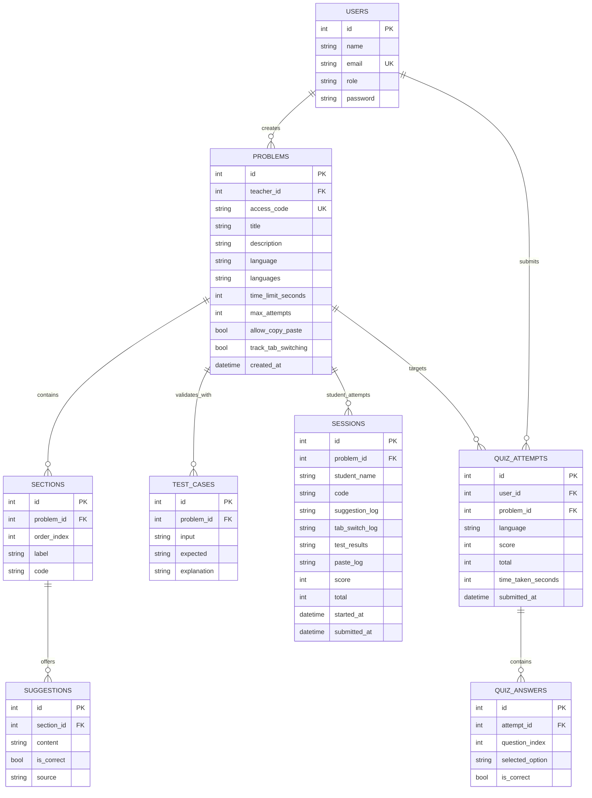

# Database Design
---

## Entity-relationship diagram

**Unique keys:** `users.email` is treated as unique at registration time. `problems.access_code` is generated so each value is distinct. Whether these are enforced with database `UNIQUE` constraints depends on the deployed schema.

**Student identity:** `sessions.student_name` is **not** an FK to `users`. Students using the access-code flow are not required to have a `users` row.

---

## Entity specifications

### 1. USERS

Represents teachers and admins (and any password-based accounts). Roles distinguish capabilities in the API.

| Attribute | Type | Key | Notes |
|-----------|------|-----|--------|
| `id` | integer | **PK** | Surrogate key |
| `name` | string | | Display name |
| `email` | string | **UK** | Login identifier; duplicate rejected on register |
| `role` | string | | e.g. `teacher`, `admin` |
| `password` | string | | Optional; OTP-only teachers may have no password hash |

**Relationships**

- **One user → many problems** (`users` 1 — 0..N `problems`) — verb *creates* / *owns* via `problems.teacher_id`.

---

### 2. PROBLEMS

A published assignment (“quiz”): metadata, access code, settings, and links to structure and attempts.

| Attribute | Type | Key | Notes |
|-----------|------|-----|--------|
| `id` | integer | **PK** | |
| `teacher_id` | integer | **FK** → `users.id` | Owner |
| `access_code` | string | **UK** | 6-digit student entry key |
| `title`, `description` | string | | |
| `language` | string | | Primary language |
| `languages` | string | | JSON array text (parsed in app) |
| `time_limit_seconds` | integer | | Optional |
| `max_attempts` | integer | | Optional cap on submitted sessions per student name |
| `allow_copy_paste`, `track_tab_switching` | boolean | | |
| `created_at` | datetime | | Used when listing problems |

**Relationships**

- **One problem → many sections** (1 — 0..N), *contains*.
- **One problem → many test_cases** (1 — 0..N), *validates_with*.
- **One problem → many sessions** (1 — 0..N), *student_attempts* (submissions).
- **One problem → many quiz_attempts** (1 — 0..N), *targets* (authenticated quiz attempts).

---

### 3. SECTIONS

Ordered blocks of instructions/starter code within a problem.

| Attribute | Type | Key | Notes |
|-----------|------|-----|--------|
| `id` | integer | **PK** | |
| `problem_id` | integer | **FK** → `problems.id` | |
| `order_index` | integer | | Sort key |
| `label` | string | | Section title |
| `code` | string | | JSON map per language (text in DB) |

**Relationships**

- **One section → many suggestions** (1 — 0..N), *offers*.

---

### 4. SUGGESTIONS

Multiple-choice or AI/manual line options attached to a section.

| Attribute | Type | Key | Notes |
|-----------|------|-----|--------|
| `id` | integer | **PK** | |
| `section_id` | integer | **FK** → `sections.id` | |
| `content` | string | | |
| `is_correct` | boolean | | |
| `source` | string | | e.g. `ai`, `manual` |

**Relationships**

- Many suggestions belong to exactly one section (N — 1).

---

### 5. TEST_CASES

Hidden or visible tests for autograding / student self-check in the UI.

| Attribute | Type | Key | Notes |
|-----------|------|-----|--------|
| `id` | integer | **PK** | |
| `problem_id` | integer | **FK** → `problems.id` | |
| `input` | string | | |
| `expected` | string | | |
| `explanation` | string | | |

**Relationships**

- Many test cases belong to one problem (N — 1).

---

### 6. SESSIONS

One student attempt on a problem: draft or submitted code plus telemetry JSON and optional manual grade fields.

| Attribute | Type | Key | Notes |
|-----------|------|-----|--------|
| `id` | integer | **PK** | |
| `problem_id` | integer | **FK** → `problems.id` | |
| `student_name` | string | | **Not** FK to `users` |
| `code` | string | | Source text |
| `suggestion_log`, `tab_switch_log`, `test_results`, `paste_log` | string | | JSON text; set on submit |
| `score`, `total` | integer | | Grading (e.g. manual percent mapped to score/total) |
| `started_at` | datetime | | |
| `submitted_at` | datetime | | Null until final submit |

**Relationships**

- Many sessions belong to one problem (N — 1).  
- **Composition:** a session belongs to exactly one problem; if the problem is removed, dependent sessions should be removed according to the database foreign-key rules.

---

### 7. QUIZ_ATTEMPTS

Authenticated quiz-style attempt tied to a `users` row and a `problems` row.

| Attribute | Type | Key | Notes |
|-----------|------|-----|--------|
| `id` | integer | **PK** | |
| `user_id` | integer | **FK** → `users.id` | From JWT |
| `problem_id` | integer | **FK** → `problems.id` | |
| `language` | string | | |
| `score`, `total` | integer | | Derived from answers |
| `time_taken_seconds` | integer | | Optional |
| `submitted_at` | datetime | | |

**Relationships**

- **One attempt → many quiz_answers** (1 — 0..N), *contains*.

---

### 8. QUIZ_ANSWERS

One row per answered question index for a quiz attempt.

| Attribute | Type | Key | Notes |
|-----------|------|-----|--------|
| `id` | integer | **PK** | Surrogate key |
| `attempt_id` | integer | **FK** → `quiz_attempts.id` | |
| `question_index` | integer | | |
| `selected_option` | string | | |
| `is_correct` | boolean | | |

**Relationships**

- Many answers belong to one attempt (N — 1).

---

## Cardinality summary

| From | To | Cardinality | Label (meaning) |
|------|-----|-------------|-----------------|
| `users` | `problems` | 1 — 0..N | Teacher creates many problems |
| `problems` | `sections` | 1 — 0..N | Problem contains many sections |
| `sections` | `suggestions` | 1 — 0..N | Section offers many suggestions |
| `problems` | `test_cases` | 1 — 0..N | Problem has many tests |
| `problems` | `sessions` | 1 — 0..N | Problem has many student attempts |
| `users` | `quiz_attempts` | 1 — 0..N | User can have many quiz attempts |
| `problems` | `quiz_attempts` | 1 — 0..N | Problem can be targeted by many attempts |
| `quiz_attempts` | `quiz_answers` | 1 — 0..N | Attempt contains many answers |

---

## Operational notes

- **Problem deletion:** Removing a problem may cascade to related rows depending on foreign-key definitions in the database.
- **Submission limits:** Submitted attempts for a given `student_name` and `problem_id` are counted against `problems.max_attempts`.
- **Time limit column:** Older databases may still use `time_limit_minutes`; the application can normalize values to `time_limit_seconds` at startup when needed.
- **Time limit column:** Older databases may still use `time_limit_minutes`; the application can normalize values to `time_limit_seconds` at startup when needed.
