# Sequence diagrams

These diagrams align with [Use-case descriptions](../requirements/use-case-descriptions): **seven** teacher use cases (numbered **1–7**) and **nine** student use cases (numbered **1–9**), for **sixteen** diagrams total.

| # | Flow |
|---|------|
| [T1](#teacher-uc-1) | Teacher - Use Case 1 - Account Creation |
| [T2](#teacher-uc-2) | Teacher - Use Case 2 - Signing In |
| [T3](#teacher-uc-3) | Teacher - Use Case 3 - Uploading Leetcode Problems |
| [T4](#teacher-uc-4) | Teacher - Use Case 4 - Publishing Problems |
| [T5](#teacher-uc-5) | Teacher - Use Case 5 - Navigating Dashboard |
| [T6](#teacher-uc-6) | Teacher - Use Case 6 - Deleting a Question from a Quiz |
| [T7](#teacher-uc-7) | Teacher - Use Case 7 - Changing a Grade for a Student |
| [S1](#student-uc-1) | Student - Use Case 1 - Student Creates an Account |
| [S2](#student-uc-2) | Student - Use Case 2 - Student Joins a Class Using an Access Code |
| [S3](#student-uc-3) | Student - Use Case 3 - Student Views Dashboard |
| [S4](#student-uc-4) | Student - Use Case 4 - Student Begins a Coding Problem |
| [S5](#student-uc-5) | Student - Use Case 5 - Student Receives and Selects Auto Code Suggestions |
| [S6](#student-uc-6) | Student - Use Case 6 - Student Runs Code to View Output |
| [S7](#student-uc-7) | Student - Use Case 7 - Student Submits Completed Work |
| [S8](#student-uc-8) | Student - Use Case 8 - Student Saves Progress and Returns Later |
| [S9](#student-uc-9) | Student - Use Case 9 - Student Reviews Completed Problems and Grades |

---

## Teacher Use Case 1 - Account Creation {#teacher-uc-1}

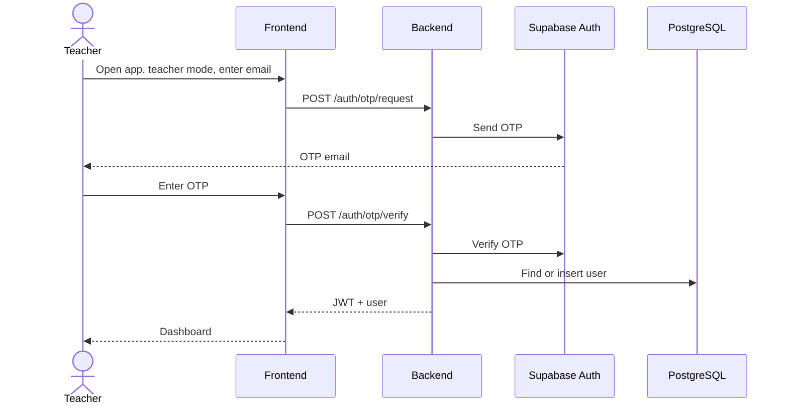

---

## Teacher Use Case 2 - Signing In {#teacher-uc-2}

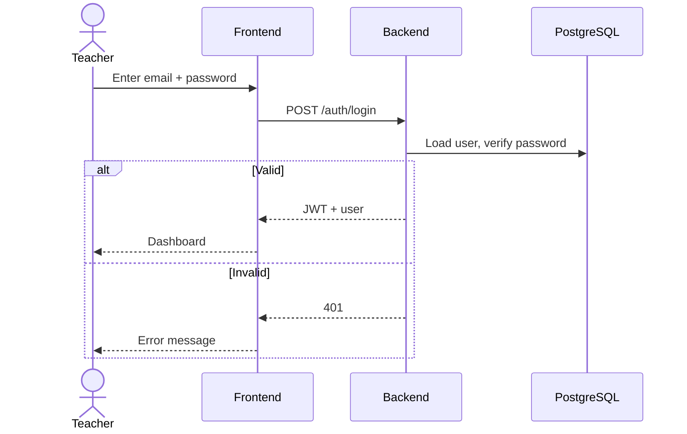

---

## Teacher Use Case 3 - Uploading Leetcode Problems {#teacher-uc-3}

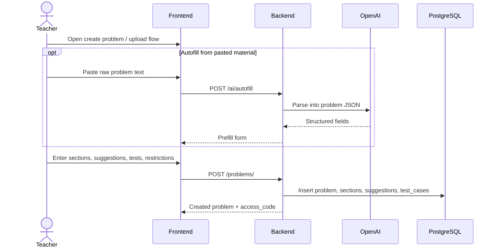

---

## Teacher Use Case 4 - Publishing Problems {#teacher-uc-4}

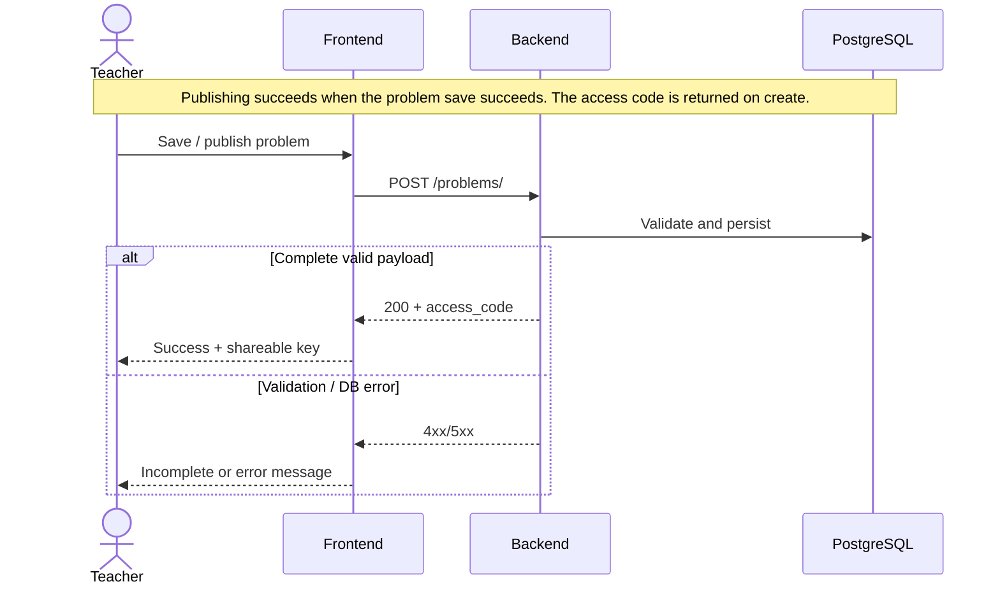

---

## Teacher Use Case 5 - Navigating Dashboard {#teacher-uc-5}

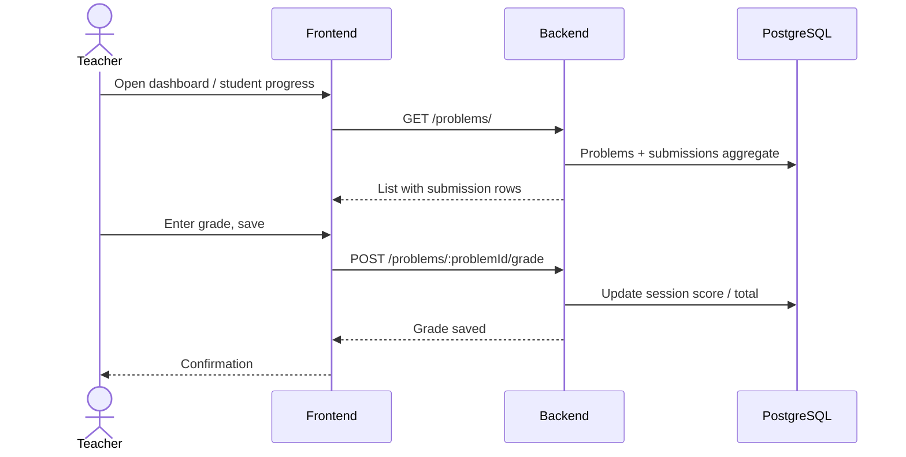

---

## Teacher Use Case 6 - Deleting a Question from a Quiz {#teacher-uc-6}

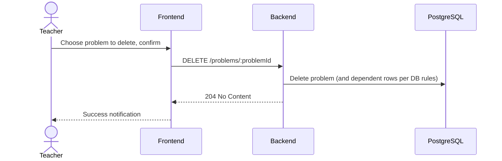

---

## Teacher Use Case 7 - Changing a Grade for a Student {#teacher-uc-7}

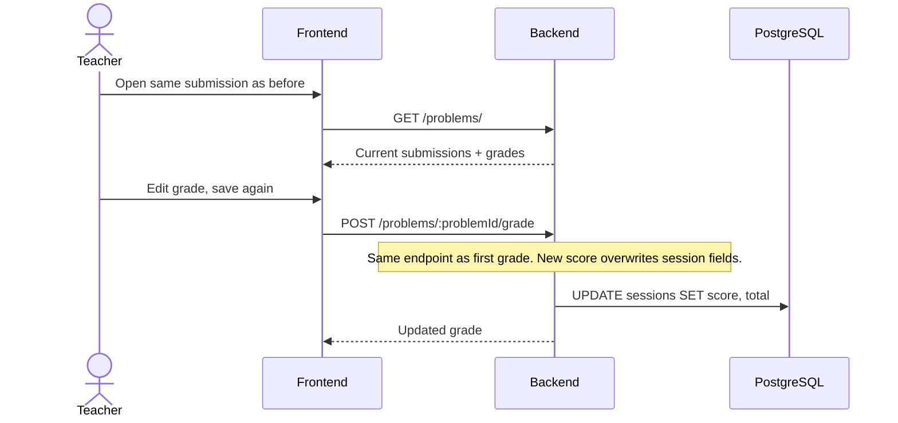

---

## Student Use Case 1 - Student Creates an Account {#student-uc-1}

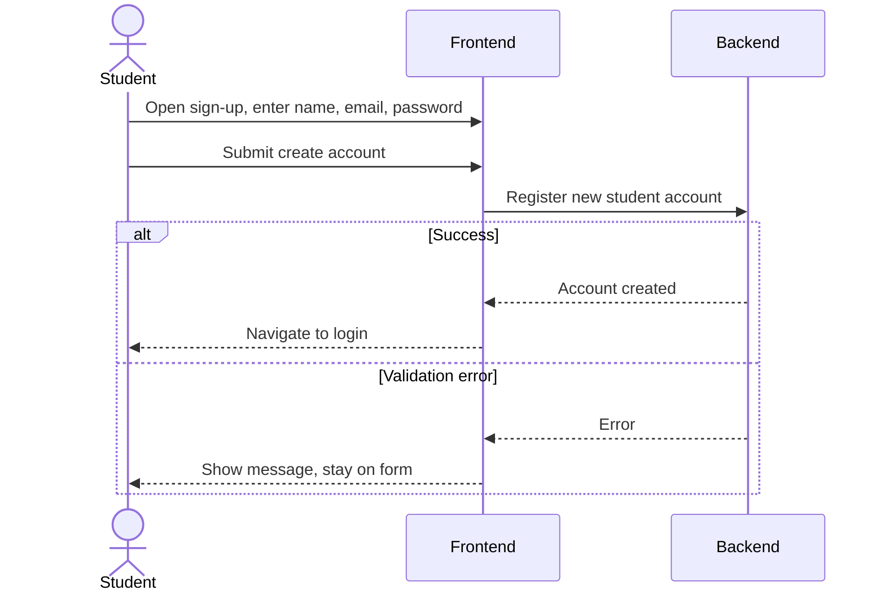

---

## Student Use Case 2 - Student Joins a Class Using an Access Code {#student-uc-2}

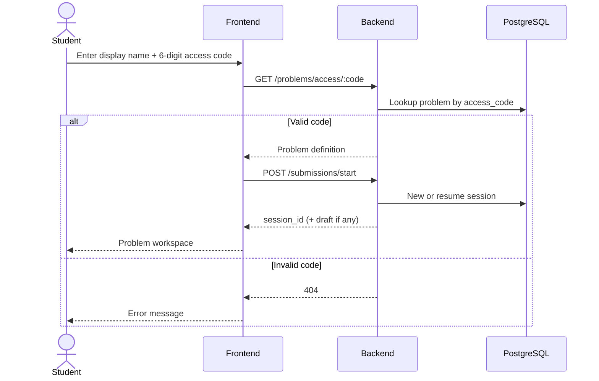

---

## Student Use Case 3 - Student Views Dashboard {#student-uc-3}

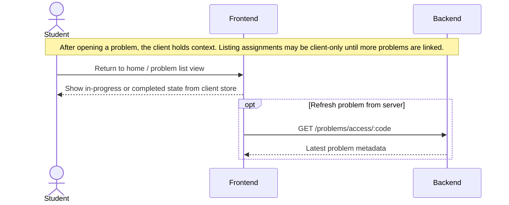

---

## Student Use Case 4 - Student Begins a Coding Problem {#student-uc-4}

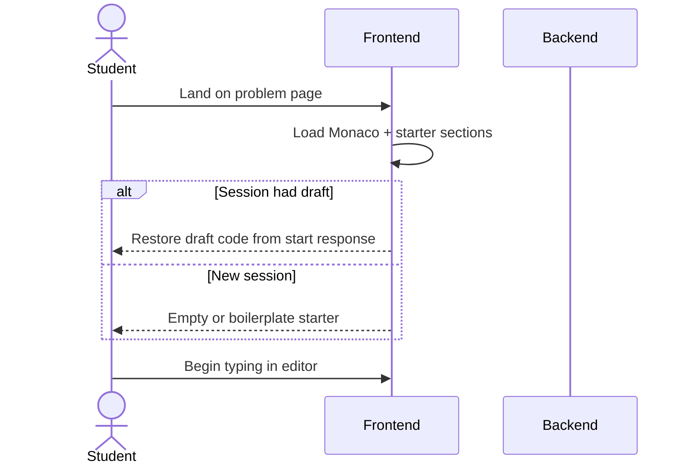

---

## Student Use Case 5 - Student Receives and Selects Auto Code Suggestions {#student-uc-5}

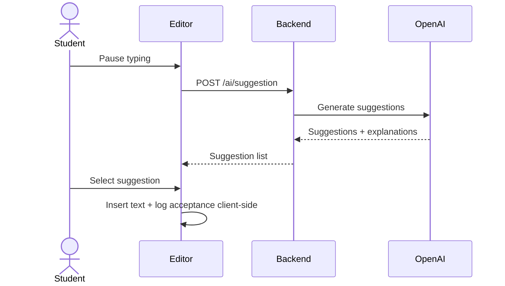

---

## Student Use Case 6 - Student Runs Code to View Output {#student-uc-6}

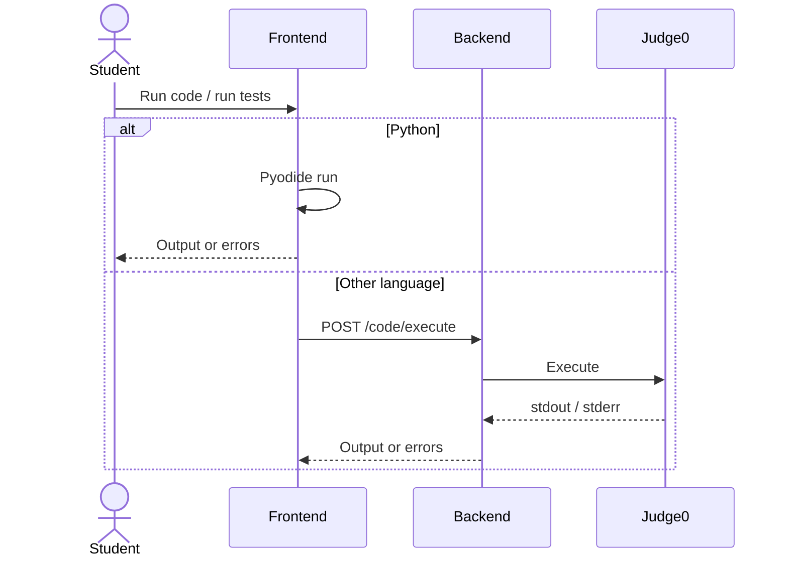

---

## Student Use Case 7 - Student Submits Completed Work {#student-uc-7}

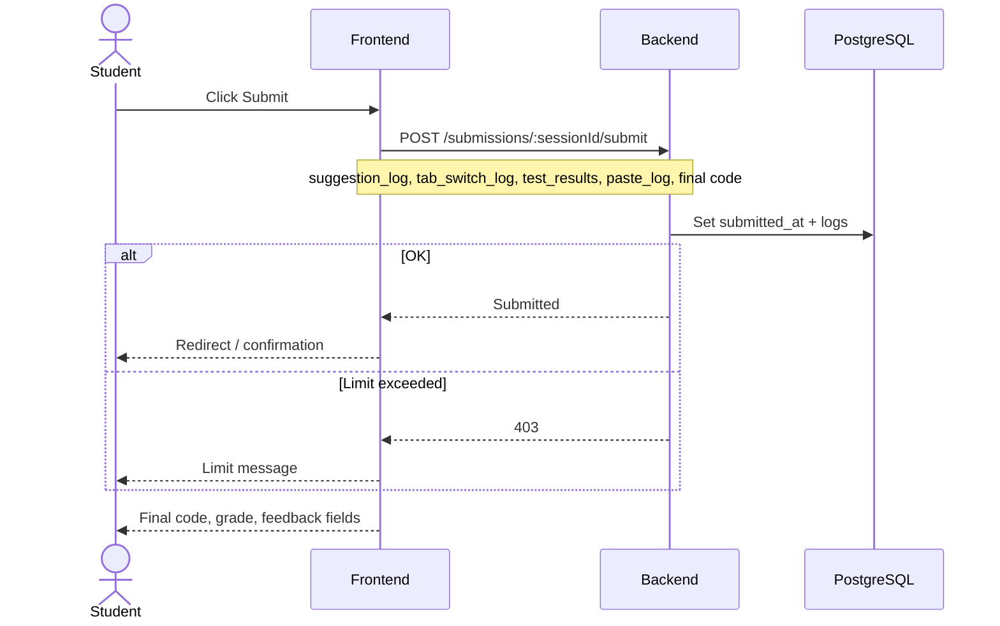

---

## Student Use Case 8 - Student Saves Progress and Returns Later {#student-uc-8}

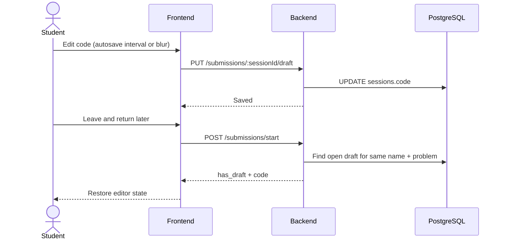

---

## Student Use Case 9 - Student Reviews Completed Problems and Grades {#student-uc-9}

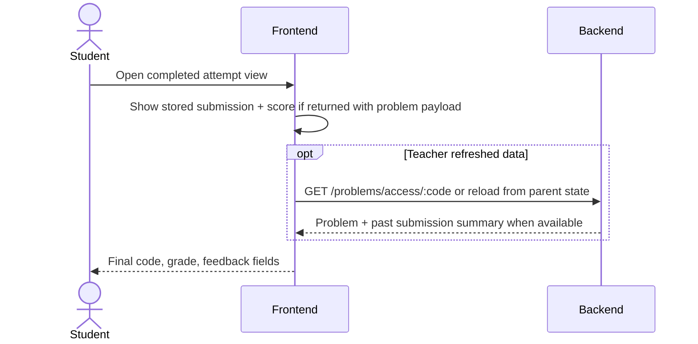